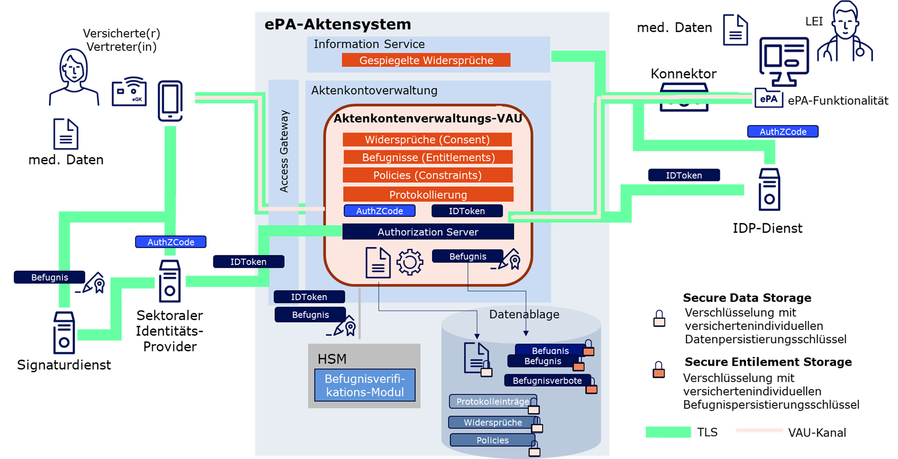
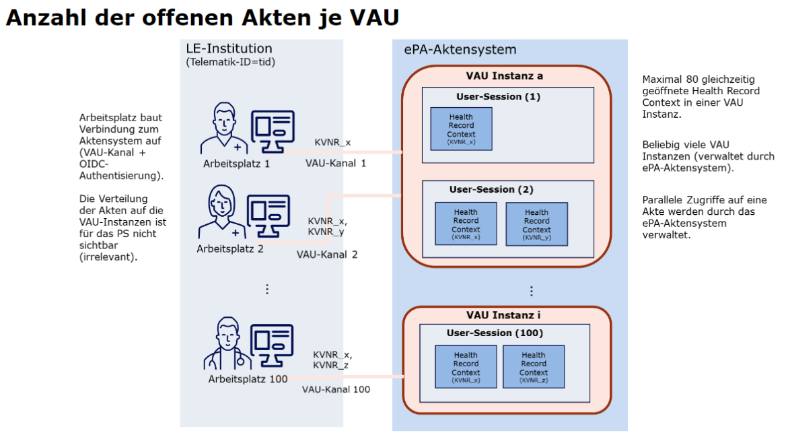

= Überblick Sicherheitsarchitektur

Die folgende Abbildung zeigt die Hauptkonzepte in der ePA-Sicherheitsarchitektur. Es lässt u.a. erkennen, wie das VAU-Kanal-Protokoll innerhalb einer TLS-Verbindung vom Primärsystem aus Richtung Aktensystem (Aktenkontoverwaltungs-VAU) verwendet wird. Weitere Details finden sich weiter unten.
Die Informationen auf dieser Seite gehen näher auf den Aufbau des VAU-Kanals ein und die Etablierung von User Sessions (nicht abgebildet) innerhalb der VAU.

== Dienste ohne VAU-Kanal

Information Service - Service zum Abruf von Informationen zu einem Aktenkonto (Lokalisierung & Widersprüche), sowie zum Sammeln von Informationen über die Leistung von Client-Anwendungen.

* Consent Mgmt:
** Widersprüche gegen ePA und Medication Service prüfen (Operation: getConsentDecisionInformation())
* Aktenkontolokalisierung:
** Prüfung, ob Aktenkonto für bestimmte KVNR auf dem jeweiligen Aktensystem vorliegt (Operation: getRecordStatus())
* UX-Daten:
*** Bereitstellen von UX-Daten von ePA-Client an Aktensystem (Operation: setUserExperienceResult())

Die Schnittstellen zur Aktenkontolokalisierung und den UX-Daten sind nicht in der Abbildung beim Information Service zu erkennen, da sie nicht sicherheitsrelevant sind.

== VAU-Kanalnutzung durch Primärsysteme

=== Was ist der VAU-Kanal

* Der VAU-Kanal (VAU für Vertrauenswürdige Ausführungsumgebung) stellt eine sichere Verbindung vom ePA-Client zum Aktensystem her
* Ist eine zweite Absicherung innerhalb eines bestehenden TLS-Kanals
* Ein und derselbe Kanal eignet sich für Zugriff auf *mehrere* Aktenkonten
* Innerhalb des VAU-Kanals wird eine User Session gebaut
** Innerhalb User Session können auf verschiedene Aktenkonten zugegriffen werden
** Innerhalb der User Session werden im Aktensystem sogenannte Health Record Contexts eröffnet (Für ePA-Client jedoch transparent, d.h. sie müssen nicht aktiv im ePA-Client verwaltet werden)

=== Wer baut einen VAU-Kanal auf?

* Beim Aufbau eines VAU-Kanals werden die VAU-Schlüssel der aktiven Verbindung beim ePA-Client gespeichert
* In der Regel muss deshalb jeder Arbeitsplatz selbst einen VAU-Kanal aufbauen
* Zudem kann ein VAU-Kanal nur einer Telematik ID (einer SMC-B-Identität) zugeordnet werden
* Achtung: Da es zwei Aktensysteme gibt, müssen zwei VAU-Kanäle aufgebaut werden, um auf Aktenkonten beider Aktensysteme zugreifen zu können
* Zentralisierung ist möglich ("VAU-Proxy" als ePA-Client/Endpunkt für VAU-Kanal oder sogar VAU-Kanäle) bei zahlreichen Arbeitsplätzen
** z. B. auch Hintergrundsynchronisierungsdienst möglich, der VAU-Kanal für verschiedene Primärsysteme (mit jeweils gleicher SMC-B-Zuordnung) "managed".
** erlaubt den Primärsystemen ohne eigene VAU-Kanal-Implementierung zu arbeiten
** erlaubt Einsatz eines zentralen Virenscanners

=== Wann soll ich den VAU-Kanal öffnen?

* So selten wie möglich, um die Last der Aktensysteme nicht unnötig zu erhöhen
** Best Practice: VAU-Kanal zu jedem der beiden Aktensysteme geöffnet halten, _sofern eine weitere Nutzung erwartbar ist_
** Empfehlung für typische PVS: Tägliche Verbindung aufbauen (max. 24 Stunden möglich)

=== Wann soll ich eine User Session aufbauen?

* Nach dem Start des VAU-Kanals (nach der Authentisierung) aufbauen
* User Session wird nach 20 Minuten Inaktivität geschlossen
* Zum Offenhalten der User Session
** regelmäßig interagieren
** oder bei fehlender Interaktion Operation /VAU-Status nutzen, um Verbindung offen zu halten ("keep-alive", seiteneffektfrei)
* Sofern keine weitere Nutzung abzusehen ist, Kanal schließen
** Es ist nicht erwartbar von Benutzern, dass diese aktiv dem PVS signalisieren, dass sie nun länger nicht auf die ePA zugreifen – klar.
** Beim Herunterfahren eines PVS ist der VAU-Kanal und die Session eh weg. Einzig im Proxy-Szenario wäre es hier sinnvoll, dem Proxy zu signalisieren, dass Clients jetzt offline sind.
** Wir gehen davon aus, dass in den meisten Szenarien eine regelmäßige Nutzung zu bestimmten Zeiten erfolgt und deshalb fast immer ein keep-alive sinnvoll ist
** Wir können uns für viele PVSe eine uhrzeitgesteuerte Umsetzung hier vorstellen:
*** Das heißt, während der Öffnungszeit einer Praxis, einer Apotheke, ... kann das System ein keep-alive dauerhaft einsetzen.
*** Außerhalb der Öffnungszeiten ist es sinnvoll, das keep-alive abzuschalten.
*** Wenn das PVS bspw. automatisch den Bildschirm sperrt nach einigen Minuten oder sie anderweitig (eh schon) eine Untätigkeit von einer Stunde feststellen, ist es auch sinnvoll auf das keep-alive zu verzichten
** Wenn Sie spezielle Nutzungsszenarien haben (z. B. nur aktive Nutzung der ePA einmal täglich), wissen Sie selbst am besten, wie Sie eine sinnvolle Regelung finden können.
** Insgesamt möchten Sie aber im Zweifelsfall zu einem keep-alive (bspw. alle 19 Minuten) ermuntern.
*** Die Aktensysteme sollten so ausgelegt sein, dass sie mit einer großen Menge an offenen VAU-Kanälen der PVS zurechtkommen.
*** Behalten Sie jedoch im Hinterkopf, dass Sie in der Regel (ausgenommen Proxy-Szenario) mit einem oder sehr wenigen VAU-Kanälen pro PVS auskommen.

=== Beispielimplementierungen VAU-Kanal

Beispielimplementierungen finden sich hier:

* https://github.com/gematik/lib-vau[In Java]
* https://github.com/gematik/lib-vau-csharp[In C# (coming soon)]
* https://bitbucket.org/andreas_hallof/vau-protokoll/src/master/minimal/[PoC in Python]
* https://github.com/gematik/zero-lab/tree/vau/pkg/libvau[PoC in GO]

== Aktenkontolokalisierung

* Jedes Aktenkonto liegt auf einem der beiden Aktensysteme
* Das richtige Aktensystem bringt man mit der Lokalisierung des Aktenkontos in Erfahrung (getRecordStatus())
* Ist ein Aktenkonto einmal lokalisiert, MUSS die Information, in welchem Aktensystem das Konto liegt, gecached werden
* Achtung: Das Aktensystem für ein Konto ändert sich sehr selten, aber es kann sich   ändern
**Aktenumzug (Wechsel der Krankenkasse)
**In diesem Fall (Fehler beim Zugriff auf das Aktenkonto) muss getRecordStatus() erneut aufgerufen werden (auf dem zweiten Aktensystem)
* Tipp:
** Wenn ein Versicherter einer bestimmten Krankenkasse bei einem bestimmten Aktensystem liegt, liegen auch die anderen Aktenkonten derselben Krankenkasse bei demselben Aktensystem
** Es reicht also in aller Regel sogar aus, zu cachen, welche "IK-Nummer" (Krankenkasse) ihre Konten auf welchem Aktensystem verwaltet, um ein bestimmtes Aktenkonto zu lokalisieren
* FQDNs:
** RU-DEV
*** IBM: epa-as-1.dev.epa4all.de
*** BITMARCK: epa-as-2.dev.epa4all.de
** RU-REF
*** IBM: epa-as-1.ref.epa4all.de
*** BITMARCK: epa-as-2.ref.epa4all.de

== Behandlungskontext registrieren

* Versicherter kommt in die Arztpraxis
* Durch Stecken der eGK wird ein Behandlungskontext für den Versicherten in der ePA etabliert
** Entsprechendes "Entitlement" wird dann im Aktensystem hinterlegt oder entsprechend verlängert
** Kontext gilt für 90 Tage (bei Apotheken und öffentlichen Gesundheitsdienst: 3 Tage), Enddatum wird mit dem Einstellen des Entitlements zurückgegeben
* Sind mehr als 90 Tage nötig, muss Versicherter die LEI auf dem FdV explizit länger befugen
** Es ist bekannt, dass 3 von 4 Quartalen mehr als 90 Tage haben
** Die 90 Tage sind eine Vorgabe an die gematik
* Zudem kann ein Versicherter
** einer LEI auch die Befugnis via FdV entziehen (Neu-Befugnis über Behandlungskontext in der Praxis möglich)
** eine LEI auf dem FdV dauerhaft "blockieren" (Neu-Befugnis über Behandlungskontext in der Praxis nicht möglich)
* Es gibt keinen separaten Aufruf für ein Primärsystem, um zu prüfen, wie lange die LEI noch befugt ist
** Eine solche Funktion wurde häufig diskutiert aber bisher abgelehnt. Einige Erwägungen dazu:
*** Im Grunde genommen ist jede Information, wie lange eine LEI noch berechtigt ist, immer als temporär bzw. voraussichtlich zu betrachten, denn das FdV kann jederzeit die Berechtigung entziehen.
*** Nach Stecken der eGK bei der LEI ist bekannt, wie lange LEI voraussichtlich noch berechtigt ist – dieser Wert kann natürlich verwendet und auch gecached werden
*** Wenn Zugriff benötigt wird, wird auf die Akte zugegriffen und so festgestellt, ob noch eine Berechtigung besteht.
** Wenn Sie unbedingt explizit herausfinden möchten, ob noch ein Zugriff besteht, auch wenn Sie eigentlich aktuell nicht mit dem Konto arbeiten möchten, können Sie versuchen, eine möglichst leichtgewichtige (Dummy)-Operation im Aktenkonto ausführen, z. B. eine "Stored Query" wie GetFolder auf einem statischen Ordner wie "emergency" (Filter nach Folder.entryUUID="a7bb6be7-d756-46dd-90d4-4020ed55b777").

== Weiterführende Informationen VAU und VAU-Instanzen

Hier finden Sie weiterführende Information zum Thema VAU, User Session und Sicherheit im Allgemeinen.

Es gilt:

* Jeder VAU-Kanal terminiert in genau einer VAU-Instanz.
* In einer VAU-Instanz können beliebig viele VAU-Kanäle terminieren.
Über den VAU-Kanal kann in der VAU-Instanz pro Kanal genau eine User Session etabliert werden.
* In einer VAU-Instanz können ein oder mehrere User Sessions existieren, von einer oder mehreren Telematik-IDs.
* Mehrere VAU-Instanzen können für dieselbe Telematik-ID geöffnet werden.
* Eine VAU-Instanz kann über mehrere VAU-Kanäle potentiell von mehreren Arbeitsplätzen genutzt werden.
** Über eine Proxy-Konstruktion können auch mehrere Arbeitsplätze über genau einen VAU-Kanal quasi parallel das Aktensystem verwenden. Es gibt in PVS dann einen "VAU-Proxy" an dem der VAU-Kanal terminiert, die Arbeitsplätze müssen sich sicher gegenüber dem VAU-Proxy in der LEI authentisieren und der VAU-Proxy sammelt quasi die Anfragen aller Arbeitsplätze (so ähnlich wie ein HTTP-Proxy), und leitet sie über den einen VAU-Kanal an das Aktensystem weiter.
* Innerhalb der VAU-Instanz werden alle Verarbeitungen und Daten einer User Session technisch getrennt von anderen User Sessions umgesetzt.
* Das Aktensystem stellt sicher, dass Zugriffe aus unterschiedlichen User Sessions auf ein Aktenkonto ("Health Record Context") synchronisiert werden.
* Wie und wann das Aktensystem VAU-Instanzen erstellt und eingehenden VAU-Kanälen zuordnet ist transparent für das PVS und aus PVS-Sicht irrelevant.
** Wenn 80 Health Record Contexts (also verschiedene Aktenkonten) bereits geöffnet sind und das PVS einen weiteren öffnet, verwirft das Aktensystem einen der 80 offenen Kontexte und öffnet einen neuen.
** Das heißt, das PVS greift einfach auf das gewünschte Aktenkonto zu und bemerkt nicht, dass im Hintergrund mglw. ein "Swap" stattfindet (altes Konto raus aus dem Speicher, neues rein).

Noch eine Abbildung zum Zusammenhang zwischen VAU-Instanzen und Health Record Contexts:

